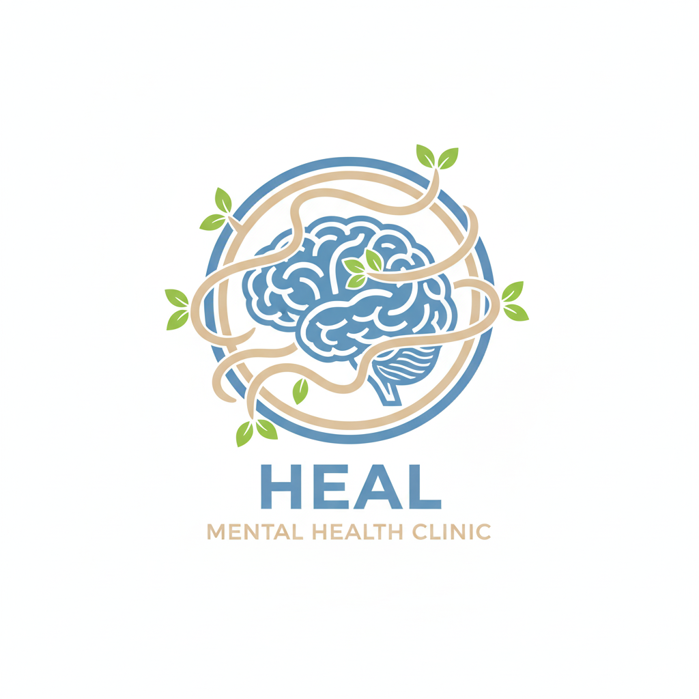

<!DOCTYPE html>
<html lang="en">
<head>
    <meta charset="UTF-8">
    <meta name="viewport" content="width=device-width, initial-scale=1.0">
    <title>Heal Mental Therapy Clinic</title>
    //this is my dream  to open clinic for mental health i did not know how to introduce my self in portfolio so built this project 
    

</head>
<body>
    

        <header id="header">
             
        </header>
        <h1 id="name"><strong>Heal Mental Therapy Clinic</strong></h1>
        

    

    <h2 id="moto">HEALING STARTS HERE 🧠</h2>

    

        <h3 id="descrip1">What is mental health?</h3>
        

            Mental health is a broad term that encompasses your emotional, psychological, and social well-being. It's a fundamental part of your overall health, <b>as important as your physical health.</b>
            Your mental health influences how you handle stress, relate to others, and make decisions throughout your life.
            It's more than just the absence of mental illness. While mental health includes the presence of conditions like depression or anxiety, it also refers to a positive state of well-being where you can cope with life's challenges, work productively, and contribute to your community. 
            It exists on a continuum. Your mental health can change over time. You might be in a state of good mental well-being one day and feel more distressed or struggle the next, depending on various factors like life experiences, genetics, and your environment.
             
            In essence, mental health is about your ability to live a fulfilling life, build relationships, and navigate the world with resilience and a sense of purpose.
        

        <h3 id="descrip2">What will happen if I go through mental health therapy?</h3>
        

            Going through mental health therapy can lead to significant changes in your life. Instead of just "fixing" a problem, it's a process of learning to understand yourself better. You'll gain a deeper awareness of your thoughts, feelings, and behaviors, and how they connect to one another. Over time, you'll develop new coping strategies and skills to manage stress, navigate difficult emotions, and handle challenges more effectively. You may also see an improvement in your relationships as you learn to communicate more clearly and set healthier boundaries. Essentially, therapy helps you build resilience and gives you the tools to live a more fulfilling and balanced life.
        

        <h3 id="descrip3">Why should I choose Heal Mental Therapy Clinic?</h3>
        

            Choose Heal Mental Therapy Clinic <b>because it is the designated beginning of your journey toward well-being</b>. 
            The clinic is more than just a place for temporary relief; it's a foundational step. It addresses the common hesitation and fear people feel before seeking help by establishing a safe, non-judgmental starting point. It suggests that no matter how overwhelming or hopeless your situation feels, this clinic is the place where you can find the support needed to begin the process of change.
        

    

    

        <h1>SIGN-UP FORM</h1>
        <form action="#" method="post">
            <label for="first_name">First name:</label>
            <input id="first_name" type="text" name="first_name" placeholder="First name" required>

            <label for="father_name">Father's name:</label>
            <input id="father_name" type="text" name="father_name" placeholder="Father's name" required>

            <label for="age">Age:</label>
            <input id="age" type="number" name="age" placeholder="Age" min="0" required>

            <label for="email">Email:</label>
            <input id="email" type="email" name="email" placeholder="Email" required>

            <label for="address">Address:</label>
            <select id="address" name="address" required>
                <option value="">Select your region</option>
                <option>Addis Ababa</option>
                <option>Afar</option>
                <option>Amhara</option>
                <option>Tigray</option>
                <option>Benishangule</option>
                <option>Central Ethiopia</option>
                <option>Gambela</option>
                <option>Harari</option>
                <option>Oromia</option>
                <option>Sidama</option>
                <option>South Ethiopia</option>
                <option>South West Ethiopia</option>
                <option>Somali</option>
            </select>

            <label for="emergency_contact_name">Emergency contact name:</label>
            <input id="emergency_contact_name" type="text" name="emergency_contact_name" placeholder="Emergency contact name" required>

            <label for="emergency_contact_number">Emergency contact number:</label>
            <input id="emergency_contact_number" type="tel" name="emergency_contact_number" placeholder="Emergency contact number" required>

            <button type="submit">SIGN-UP</button>
        </form>
    

     
    <footer>
        
Phone number: +251911223344

        
Email: ruhamaforreal2021@gmail.com

    </footer>

</body>
</html>

